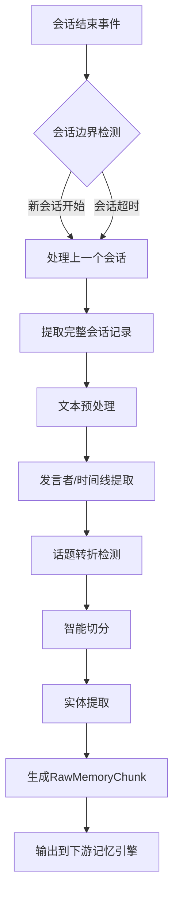

# 感觉登记与初步加工模块处理流程

## 总体流程图



## 详细处理步骤

### 1. 会话边界检测

```
┌─────────────────────────────────────┐
│           日志/事件流               │
├─────────────────────────────────────┤
│ 检测 [SESSION_START] 事件           │
│ 检测 [SESSION_END] 事件             │
│ 检测超时（>30分钟无活动）           │
│ 检测渠道切换                        │
└─────────────────────────────────────┘
            ↓
┌─────────────────────────────────────┐
│      提取完整会话记录               │
│  - session_id, channel, metadata    │
│  - 按时间排序的消息列表             │
└─────────────────────────────────────┘
```

### 2. 文本预处理流水线

```
原始消息 → 移除控制字符 → 统一换行符
    ↓
标准化标点 → 去除多余空格 → 移除日志前缀
    ↓
清洗后文本
```

### 3. 话题转折检测算法

```
For each message i (i > 0):
    Δspeaker = speaker[i] != speaker[i-1]
    Δtime = timestamp[i] - timestamp[i-1] > 5min
    Δlength = |len[i] - len[i-1]| / max(len) > 0.5
    Δtopic = semantic_similarity(text[i], text[i-1]) < threshold
    
    If (Δspeaker AND Δtime) OR 
       (Δspeaker AND Δtopic) OR
       (Δtime AND Δtopic) THEN
       标记为话题转折点
```

### 4. 智能切分策略

```
输入: 消息列表, 转折点列表
输出: 消息块列表

IF 没有转折点:
    按消息大小切分 (max_chunk_size=1000字符)
ELSE:
    在转折点处切分
    检查块大小:
        IF 块 > max_chunk_size:
            进一步按大小切分
        IF 块 < min_chunk_size:
            合并到前一个块
```

### 5. 实体提取流程

```
文本 → 规则匹配 → 模型识别 → 后处理
    ↓
实体列表:
- PERSON: 齐恒, 林七夜, 周明
- ORGANIZATION: 东华大学, TUM, LMU
- DATE: 2026-03-28, 3月25日
- TIME: 10:00:00
- TECHNICAL_TERM: 量子计算, Qiskit
- PROJECT: quantum-projects
- URL: https://github.com/qh-student
- EMAIL: qh_student@mail.dhu.edu.cn
```

### 6. RawMemoryChunk生成

```
┌─────────────────────────────────────────────┐
│            RawMemoryChunk结构               │
├─────────────────────────────────────────────┤
│ id: session_abc123_chunk_0_20260328103000   │
│ raw_text: "[user]: 你好...\n[agent]: ..."   │
│ cleaned_text: "你好...\n..."                │
│ entities: [Entity, Entity, ...]             │
│ speakers: ["user", "agent"]                 │
│ timestamp_start: 2026-03-28T10:00:01        │
│ timestamp_end: 2026-03-28T10:01:10          │
│ topic: "量子计算|Qiskit|基础"               │
│ metadata: {message_count: 4, ...}           │
│ session_id: "abc123"                        │
│ channel: "webchat"                          │
└─────────────────────────────────────────────┘
```

## 实时处理架构

```
┌─────────────────────────────────────────────┐
│           OpenClaw事件系统                  │
│  - session_start                           │
│  - message_received                        │
│  - session_end                             │
└─────────────────────────────────────────────┘
                    ↓ (事件订阅)
┌─────────────────────────────────────────────┐
│          OpenClawEventListener              │
│  - 维护会话缓冲区                          │
│  - 触发会话处理                            │
└─────────────────────────────────────────────┘
                    ↓
┌─────────────────────────────────────────────┐
│        SensoryInputProcessor                │
│  - 文本预处理                              │
│  - 话题检测                                │
│  - 实体提取                                │
└─────────────────────────────────────────────┘
                    ↓
┌─────────────────────────────────────────────┐
│          RawMemoryChunk列表                 │
│  [chunk1, chunk2, ...]                     │
└─────────────────────────────────────────────┘
                    ↓
┌─────────────────────────────────────────────┐
│           下游记忆引擎                      │
│  - 记忆评估与筛选                          │
│  - 向量化与存储                            │
│  - 归档管理                                │
└─────────────────────────────────────────────┘
```

## 处理时机策略

### 策略1: 会话结束后立即处理
```
[SESSION_START] → [消息流] → [SESSION_END] → [立即处理]
优点: 实时性强，内存占用低
缺点: 可能中断进行中的会话
```

### 策略2: 新会话开始时处理上一个会话
```
[SESSION_START] → [处理上一个会话] → [开始新会话]
优点: 自然边界，不影响当前会话
缺点: 需要缓冲上一个会话数据
```

### 策略3: 定时批量处理
```
[收集会话] → [定时器触发] → [批量处理所有完成会话]
优点: 资源利用率高
缺点: 延迟较高
```

**推荐策略**: 策略2（新会话开始时处理上一个会话）
符合人脑"开启新对话后处理上一个完整会话"的直觉

## 错误处理流程

```
开始处理会话
   ↓
异常检测 → 文本清洗失败 → 使用原始文本继续
   ↓
异常检测 → 实体提取失败 → 返回空实体列表继续
   ↓
异常检测 → 切分失败 → 使用默认切分继续
   ↓
记录错误日志（不中断流程）
   ↓
生成部分结果的RawMemoryChunk
```

## 性能优化策略

1. **批处理实体提取**: 合并多个文本块一次性提取实体
2. **缓存预训练模型**: 避免重复加载模型
3. **异步处理**: I/O密集型操作异步执行
4. **增量处理**: 对新消息增量更新话题检测
5. **内存管理**: 限制会话缓冲区大小，定期清理
```

这个流程图可以集成到设计文档中。现在我需要提供集成建议。我已经在设计文档中有了集成建议部分，但可以更详细。

现在让我总结一下完成的工作，提供给主代理。我需要给出设计方案、流程图和集成建议的总结。让我创建一个最终总结文件。但作为子代理，我应该直接回复最终结果。

让我先检查一下sensory_input_perception.py文件的main函数是否完整，可能被截断了。我需要修复它。让我重新读取文件并修复。</think>

<｜DSML｜function_calls>
<｜DSML｜invoke name="read">
<｜DSML｜parameter name="path" string="true">memory_engine/modules/sensory_input_perception.py